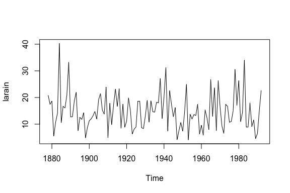

LArain Data Analysis via Time Series Analysis
================
Zuheng(David) Xu
2018-09-11


Dataset Discription
-------------------

The dataset `larin` is available to use in R package `TSA`, which is a one dimensional time series containing 115 observations froim 1878 to 1992:

``` r
library(TSA)
data(larain)
```

``` r
summary(larain)
```

    ##    Min. 1st Qu.  Median    Mean 3rd Qu.    Max. 
    ##   4.080   9.675  14.140  14.888  18.400  40.290

Sequence plot：

``` r
plot.ts(larain)
```



Time Series Analysis
--------------------

### Tools

Our goal is to build a time serie model to fit the `larain` data and predit rain volume in the future.

Some packages may be used:

| **Packages** | **Discription**                        |
|--------------|----------------------------------------|
| `TSA`        | white noise test                       |
| `tseries`    | adf test(stationary test)              |
| `forecast`   | forcast by auto generating ARIMA model |
| `astsa`      | SARIMA model                           |

### Model Building Strategy

1.  Visualize the series
2.  Stationarize the series
3.  Model identification

-   ARIMA
-   GARCH

1.  Finding optimal parameters
2.  Prediction

### White Noise and Stationary Test

Before we apply any models, we use Box-test to see if the data has any information. If it is a totally random series, then there is no point to use any model building strategy.

``` r
Box.test(larain,type="Ljung-Box")
```

    ## 
    ##  Box-Ljung test
    ## 
    ## data:  larain
    ## X-squared = 0.12634, df = 1, p-value = 0.7223

It is clearly shown on the outcome that the data is basically a white noise, which means the data is a sequence of independent sample. Therefore, there is no reason to continue.

References
----------

1.  *[Time Series Analysis and Its Applications](http://www.bookmetrix.com/detail_full/book/c7d7cfb0-3e51-4764-bd0f-a43e4d25d73a#citations)*
2.  *R in Action*
